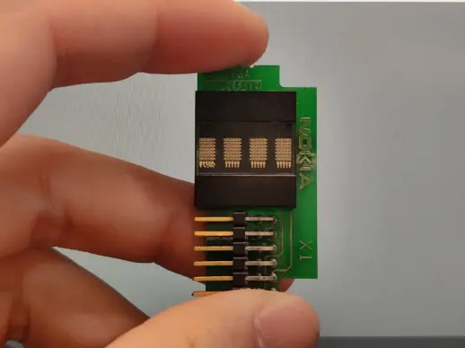
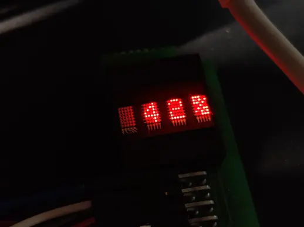
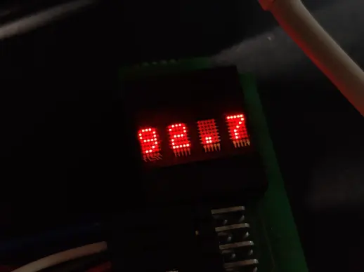

# 前言

(If don't now this document,use google Translate please)

DLO1414,DLO1414,DLO1414还有个惠普的HPDL1414，都是这种四位显示屏，本身显示效果我觉得是还不错的。


这一次我也买了一些模块，那么要具体使用，我也会进行一个简单的说明，这是一个最低也要4.5V驱动的模块，但是逻辑电压可以不用很高，2V就可以。

# 如何连接

首先它的引脚有这么多也就是12个，然后除去gnd和vcc以外，其他几个都要连到你的MCU，上面当然你可以使用其他一些方法，比如说I2C的扩展io口这类来减少这种引脚的使用。


这里我采用的是直接连接的方式，然后用的是Arduino 莱昂纳多，我买到的是从NOKIA设备上拆下的，所以长这样。这一个玩意现在价值人民币25元左右




如果你买到的和我的一样那么这一个模组的定义是这样的


## 显示效果如下
  






# 要怎么使用

首先，按照实际的连接，对所有的引脚都进行了定义，WR的作用是高电平不读写，低电平下写模块有效

```javascript

#define H0 2
#define H1 3
#define H2 4
#define H3 5
#define H4 6
#define H5 7
#define H6 8
#define WR A0
#define HA0 9
#define HA1 10

```

之后我们需要段选，是通过a0和a1这两个引脚来进行的，选中的就可以写入。
```javascript

void Select_Seg(int i)
{
  switch (i)
  {
  case 0:

    digitalWrite(HA0, HIGH);
    digitalWrite(HA1, HIGH);
    break;
  case 1:

    digitalWrite(HA0, HIGH);
    digitalWrite(HA1, LOW);
    break;
  case 2:
    digitalWrite(HA0, LOW);
    digitalWrite(HA1, HIGH);
    break;
  case 3:
    digitalWrite(HA1, LOW);
    digitalWrite(HA0, LOW);
    break;
  }
}

```

但是需要注意的是，有的时候会需要你等待一定的时间才能实现隔一位进行写入。

比如说单次程序要写0和2位的时候，必须要间隔一段时间，不然的话就会被写到第1位上去

例如要写01 3  如果没有间隔时间显示的就是0133

选位后，之后就是数据的显示，我设计的是这个函数

```java
void DLWrite(int i6, int i5, int i4, int i3, int i2, int i1, int i0)

```

通过这张表，可以实现显示字符。然后读表时候需要注意的是，列是从下往上的。


当然，在实际的使用中并不会需要看表，我设计了这个函数，现在你可以像是一般打印一样简单并且快速的输入文字，并且显示出来

```java
void DLprint(int i)
void DLprint(String s)
```

超过4位的字符会向左移动滚动显示

